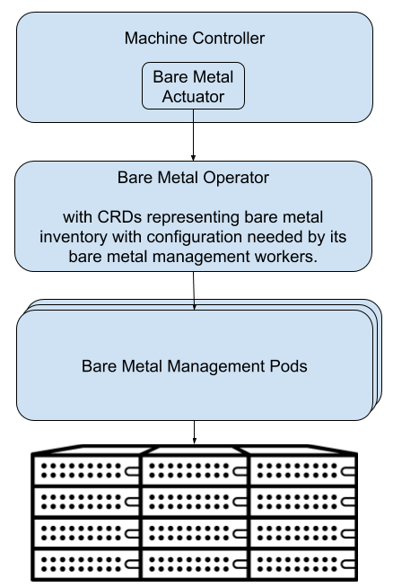

# MetalKube Documentation

The MetalKube project exists to provide components that allow you to do bare
metal hardware management for Kubernetes.

A key element to the MetalKube project is providing bare metal hardware
management as a Kubernetes Application, which is an application that both runs
on Kubernetes and is managed through Kubernetes interfaces.

[Operators](https://github.com/operator-framework/operator-sdk) are a key piece
of the MetalKube architecture as the method used to manage kubernetes
applications.

## MetalKube Component Overview

### Machine API Integration

Another set of components is being designed and built to provide integration
with the Kubernetes [Machine
API](https://github.com/kubernetes-sigs/cluster-api).

This first diagram represents the high level architecture:

#### Machine API Actuator

The first component is the [Bare Metal
Actuator](https://github.com/metalkube/cluster-api-provider-bare-metal).  This
is the component with logic specific to this architecture for handling changes
to the lifecycle of Machine objects.  This actuator may be integrated with the
existing [Machine API
Operator](https://github.com/openshift/machine-api-operator).

#### Bare Metal Operator

The architecture also includes a new [Bare Metal
Operator](https://github.com/metalkube/bare-metal-operator), which includes the
following:

* A Controller for a new Custom Resource, BareMetalHost.  This custom resource
  represents an inventory of known (configured or automatically discovered)
  bare metal hosts.  When a Machine is created the Bare Metal Actuator will
  claim one of these hosts to be provisioned as a new Kubernetes node.
* In response to BareMetalHost updates, will perform bare metal host
  provisioning actions as necessary to reach the desired state.  It will do so
  by managing and driving a set of underlying bare metal provisioning
  components.
* The implementation will focus on using Ironic as its first implementation of
  the Bare Metal Management Pods, but aims to keep this as an implementation
  detail under the hood such that alternatives could be added in the future if
  the need arises.

### Ironic Operator

The [Ironic Operator](https://github.com/metalkube/ironic-operator) can be used
to run a standalone instance of Ironic on Kubernetes.  The management of the
Ironic instance is done via CRDs.

This component can be used if your use case is to use the Ironic project to do
bare metal management, and you intend to write applications that interact with
the Ironic API directly.
